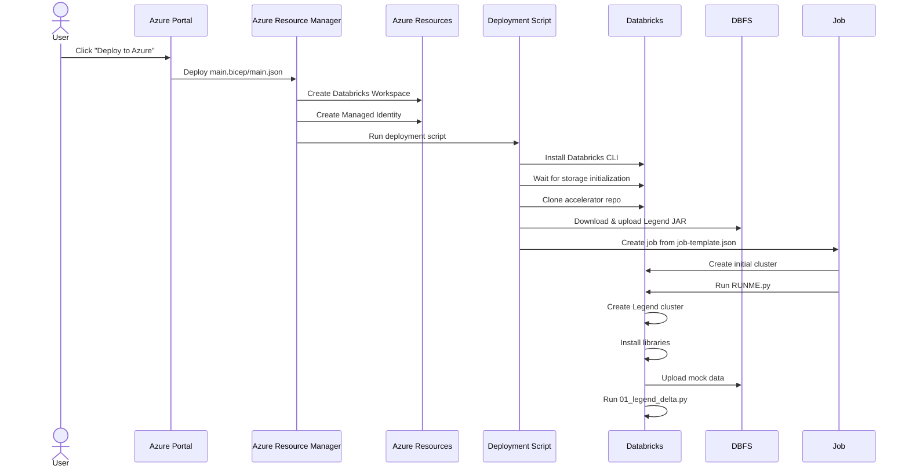

# Azure Deployment with Bicep

This directory contains resources for automating the deployment of the Legend Getting Started accelerator to Azure Databricks using a Bicep template.

## Deployment Architecture

The deployment process follows this workflow:

## Deployment Components

### main.bicep/main.json

The main Bicep template creates the core Azure resources:
1. A managed identity with appropriate permissions
2. An Azure Databricks workspace (or uses an existing one)
3. Triggers the databricks.bicep module to handle Databricks-specific setup

### databricks.bicep

This module handles the Databricks-specific deployment steps:
1. Installs the Databricks CLI
2. **Waits for Azure Databricks storage initialization** - critical for reliable deployment
3. Clones the accelerator repository from GitHub
4. Downloads and uploads the Legend JAR to DBFS
5. Creates and submits a job to run the RUNME.py notebook

### job-template.json

Defines the configuration for the initial job that:
1. Creates a cluster with appropriate specifications
2. Runs the RUNME.py notebook using this cluster

### RUNME.py

The setup notebook that:
1. Creates a secondary "Legend cluster" with the specific runtime (10.4.x-scala2.12) required for Legend Delta
2. Installs the required libraries:
   - PyPI: legend-delta==0.1.10, PyYAML==6.0.2
   - Maven: org.finos.legend-community:legend-delta:0.1.10
   - JAR: employee-model-entities-0.0.1-SNAPSHOT.jar
3. Uploads the sample data (MOCK_DATA.json) to DBFS
4. Executes the main accelerator notebook (01_legend_delta.py)