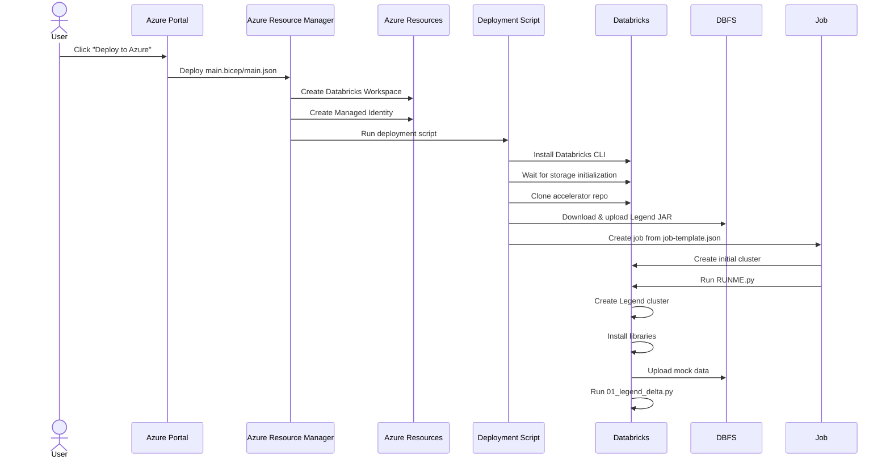

# Azure Deployment with Bicep

This directory contains resources for automating the deployment of the Legend Getting Started accelerator to Azure Databricks using a Bicep template.

## Deployment Architecture

The deployment process follows this workflow:

## Deployment Components

### main.bicep/main.json

1. Called by the "Deploy to Azure" button in the main README
2. Creates or uses an existing Azure Databricks resource
3. Runs a deployment script that:
   - Installs the Databricks CLI
   - Waits for Azure Databricks resource to finish creating the Managed Resource Group (MRG) storage containers
   - Clones accelerator repo and gets its ID
   - Downloads Legend JAR from repo, and uploads it to DBFS
   - Adds RUNME.py path into job-template.json
   - Creates and runs a Databricks job, using job-template.json as the configuration

### job-template.json

1. Instructs Databricks job to:
   - Create a cluster
   - Run RUNME.py notebook using the created cluster

### RUNME.py

1. Creates another cluster (Legend cluster) with specific configuration
2. Installs PyPI, Maven, and Legend JAR libraries into the created cluster
3. Uploads the mocked data file (MOCK_DATA.json) to DBFS
4. Runs the main accelerator notebook (01_legend_delta.py)